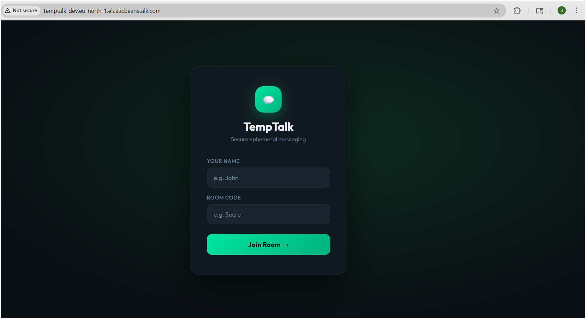
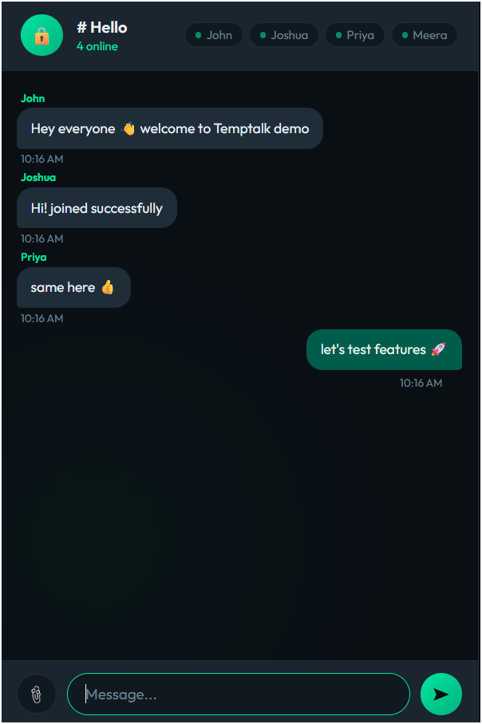
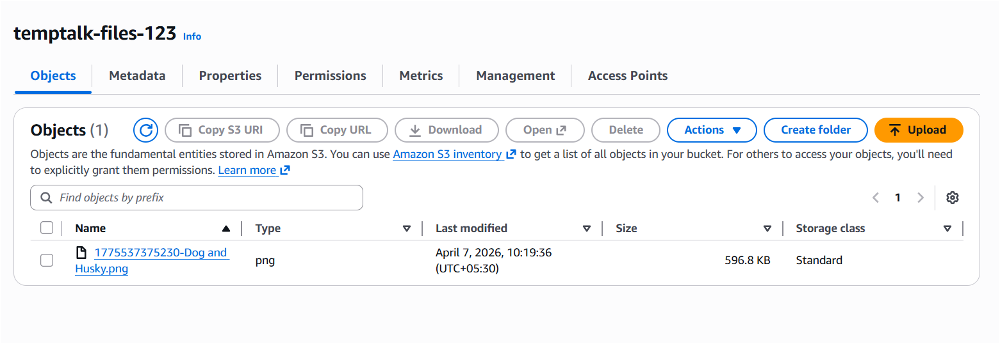
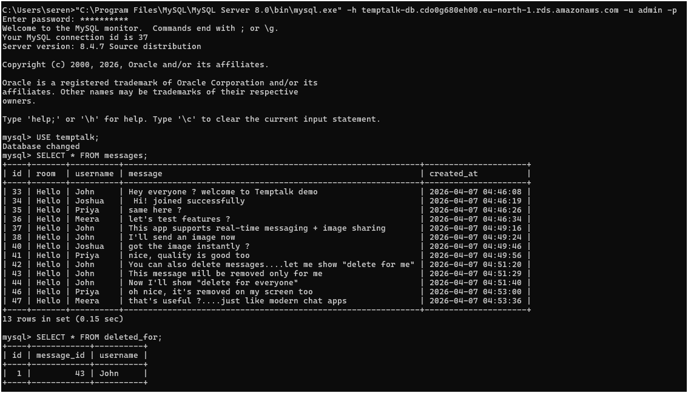
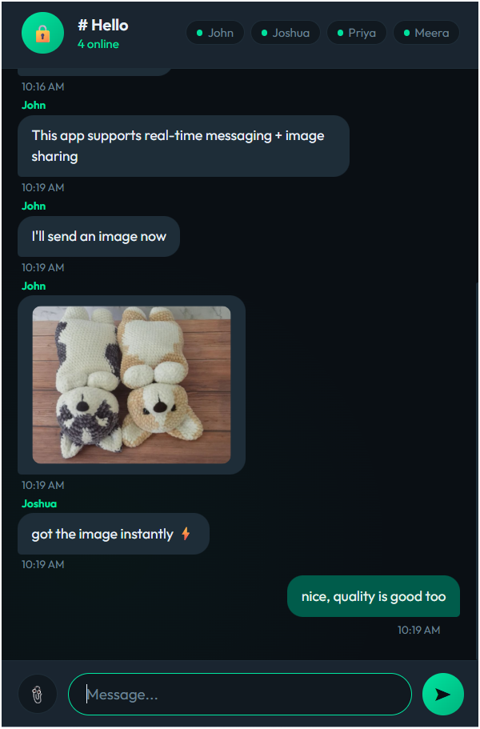

# 💬 TempTalk — Cloud-Native Real-Time Chat Application

## 🚀 Project Overview
TempTalk is a cloud-based real-time chat application deployed on AWS.  
The project demonstrates end-to-end cloud architecture by integrating compute, storage, and database services in a scalable environment.

---

## ☁️ Cloud Architecture

- AWS Elastic Beanstalk → Hosts Node.js backend
- AWS RDS (MySQL) → Stores chat messages
- AWS S3 → Stores uploaded images/files
- AWS IAM → Secure access management
- Environment Variables → Secure configuration

---

## 🔥 Features

- Real-time messaging using Socket.IO
- Multi-user chat rooms
- Live online users tracking
- Typing indicator
- Image upload (stored in AWS S3)
- Delete messages:
  - Delete for everyone
  - Delete for me (user-specific logic)

---

## 🧠 Key Implementations

### Delete-for-Me Logic
Messages are not deleted globally.  
A separate table (`deleted_for`) is used to track user-specific deletions, and messages are filtered during retrieval.

### S3 File Handling Fix
Handled URL encoding issues (`%20`) using `decodeURIComponent` before deleting files from S3.

---

## 🛠️ Tech Stack

- Node.js
- Express.js
- Socket.IO
- MySQL (AWS RDS)
- AWS (Elastic Beanstalk, S3, IAM)
- Multer (file upload handling)

---

## ☁️ Deployment (AWS)

1. Application deployed using AWS Elastic Beanstalk
2. Backend connected to AWS RDS (MySQL)
3. File uploads stored in AWS S3
4. Environment variables configured securely in AWS

Access the application via the Elastic Beanstalk URL.

---

## 🔐 Security Practices

- Sensitive data stored in environment variables (.env)
- .env excluded using .gitignore
- AWS access keys rotated after exposure
- IAM used for secure access control

---

## 📸 Screenshots

### 🚀 Elastic Beanstalk Deployment

### 💬 Chat Application UI

### ☁️ AWS S3 File Storage

### 🗄️ RDS Database Tables

### 🖼️ Uploaded Image in Chat

---

## 🎯 Learning Outcomes

- Built and deployed a cloud-based full-stack application
- Integrated multiple AWS services (EB, RDS, S3)
- Implemented real-time communication using WebSockets
- Applied secure practices for cloud applications

---

## 🚀 Future Improvements

- Docker containerization
- CI/CD pipeline (GitHub Actions)
- HTTPS + custom domain
- User authentication (JWT)
